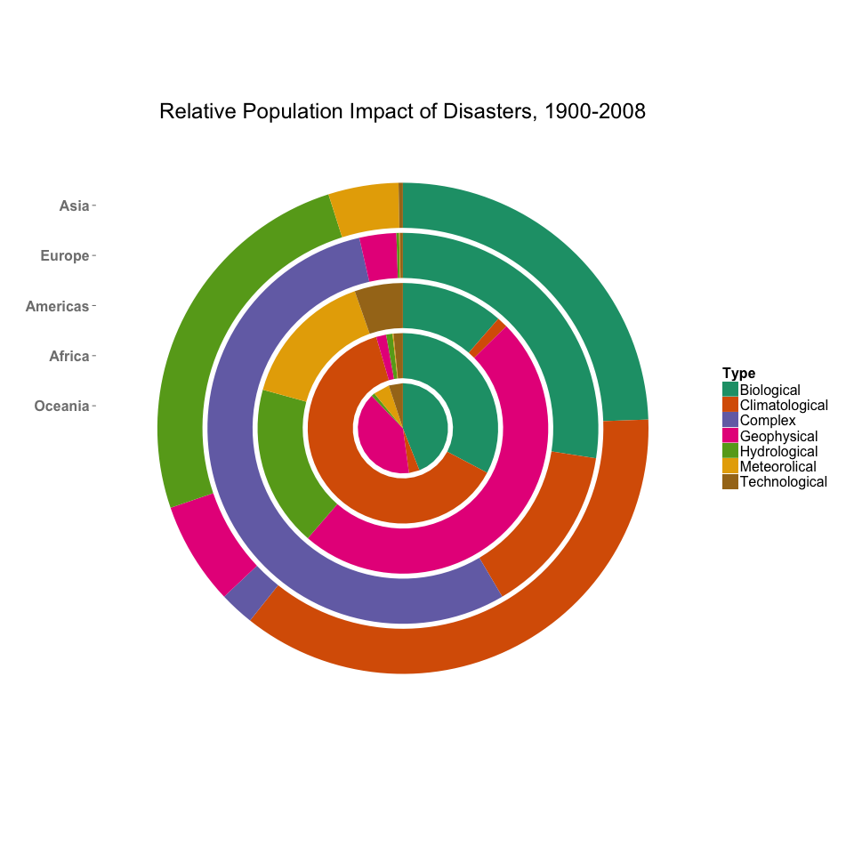

## Graphic

The graphic represents the contribution of a particular type of disaster category to the total disaster-related death toll for a continent between 1900 and 2008. The slices are all normalized, and thus represent the _relative_ contributions rather than absolute numbers. The data is sourced from [EM-DAT International Disaster Database](http://www.emdat.be/database).

## Data Cleaning

The type of presentation was heavily influenced by the completeness of the dataset. While every listed disaster had a reported death toll, only a fraction had a reported cost. As such, the presentation focuses on the human costs rather than the economic costs to avoid conjecturing based off the limited available data.

An attempt was made to manually refine the disaster categories, both for aesthetic reasons (long names don't look good in a legend) and for clarity of presentation. E.g. although tsunamis are indeed caused by earthquakes, they are deadly for a different reason and are likely to affect coastal regions more than land-locked areas. Furthermore, extreme temperatures can either be extremely cold or extremely hot, and should be therefore discernible from each other.

The country-continent assignment was not available in the original dataset, but EM-DAT provides a convenient tool to query the database. I was able to use that tool to download a mapping label that was then joined onto the primary dataset.

## Design Rationale

One of the primary issues of the provided dataset is the reporting of human casualties in raw numbers rather than percentages of a country/continent's population. Asia comprises ~60% of the world's population, and so while it carries the largest disaster-related death toll, little is known how that metric compares to the overall population of the continent. To that end a decision was made to normalize each slice and report the _relative_ contribution of a particular disaster type. Furthermore, each continent has an equal slice of the pie plot, regardless of its population (more on this below).

Continents were chosen as as the grouping for the plot due to there only being five of them. Ideally I would have preferred to split up Americas into South and North America, but this proved impractical due to the naming standards of the database. Ideally I would have done a merge between the EM-DAT data and some external Country-Region mapping, but apparently there are many ways of naming a country. So for simplicity I opted to use EM-DAT's own continent-country map, which did not split up Americas.

## Visualization Tools

The graphic was created in RStudio using the ggplot2 package. All data cleaning and aggregating was also performed in R using the dplyr package. As I am a novice to ggplot2 style, I left most of the options (including the color theme) standard. I've removed the gridlines and tickmarks since they interfered with interpreting the polar-coordinate nature of the chart. I believe this should be fixable by diving deeper into ggplot and is on my ToDo list for improving this graphic.

## Issues

The original intention was to have a Wind Rose plot, where the width of each slice corresponded to the relative population of each continent and the height to the total disaster impact. Under this visualization, a skinny&tall sliver would mean a region bore a disproportionate brunt of disaster deaths, while a narrow&short sliver would indicate a popular but relatively safe region. Unfortunately I simply could not finagle ggplot into displaying the data in such a scheme and was forced to abandon the idea. I am planning on revisiting this project once I learn R a bit better to attempt creating such a plot.

All code to replicate this graphic is available in my [GitHub repository](https://github.com/eyedvabny/berkeley-visualization/tree/master/PS1_Visualization_Design)
